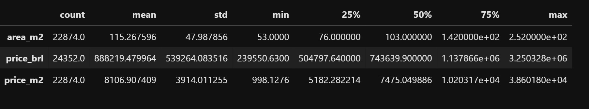
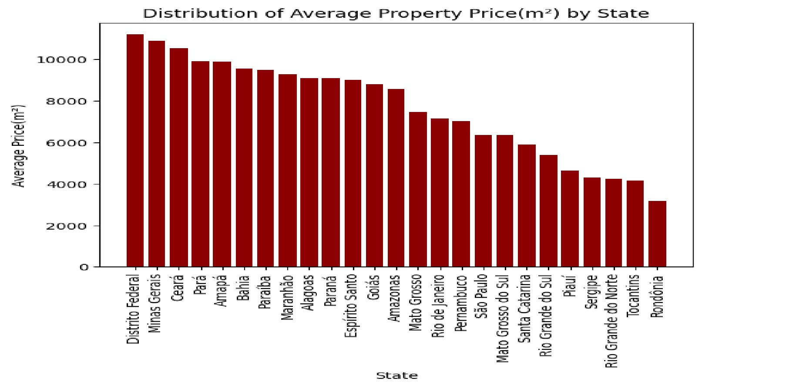
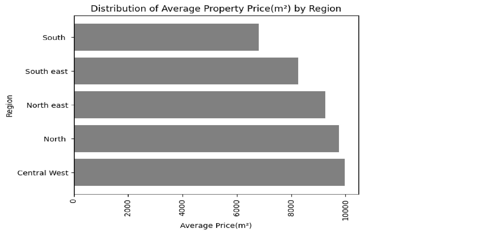
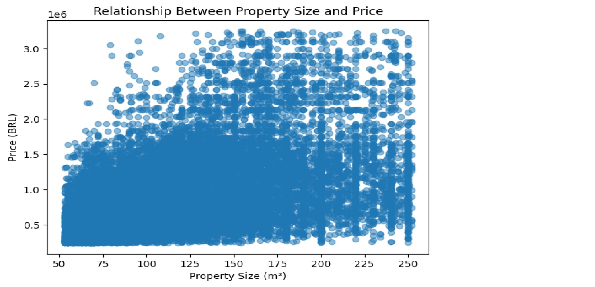
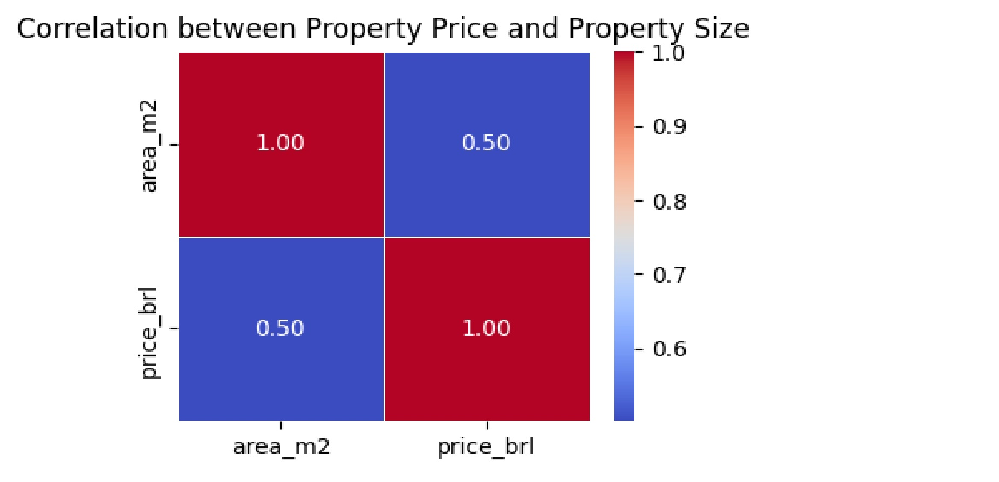
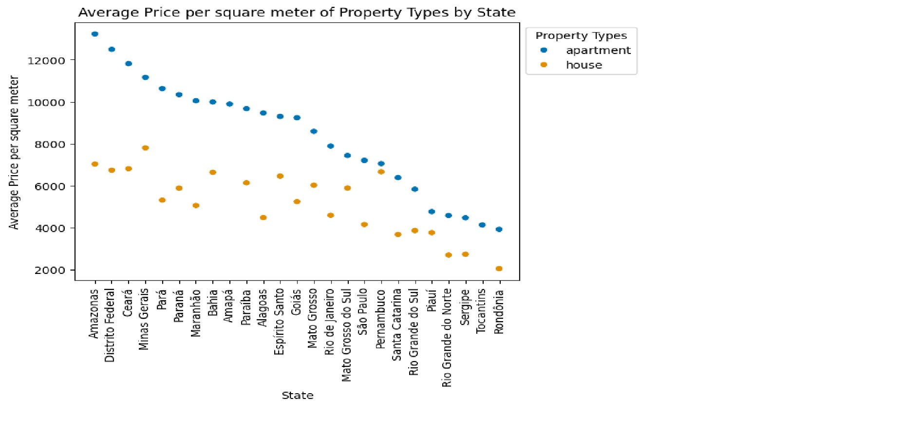
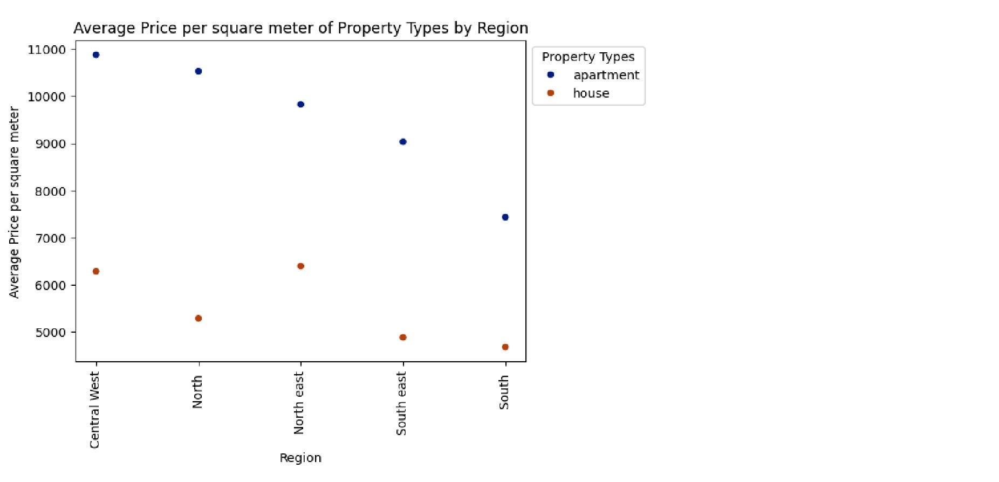

### BRAZIL HOUSING PROJECT
This project is about getting insights from Brazil real estate data.  
Analysis was conducted using visualizations to uncover trends and patterns.  

### BUSINESS QUESTIONS
The following questions guided the project:  
- Which regions top the Brazilian real estate market?
- Is there any relationship between property size and prices in Brazil?
- Which states top the Brazilian real estate market?

### DATA UNDERSTANDING
There were two (2) datasets with similar columns.  
Both datasets contained the following columns:  

1. **`property_type`**:
   - Type of property, such as "apartment" and "house".

2. **`state`**:
   - The state where the property is located, e.g., "São Paulo" or "Pernambuco."

3. **`region`**:
   - A more localized area or neighborhood within a state, such as "North East", or "South".

4. **`lat` (Latitude)**:
   - Geographic coordinate indicating how far north or south the property is located.

5. **`lon` (Longitude)**:
   - Geographic coordinate indicating how far east or west the property is located.

6. **`area_m2`**:
   - The size of the property in square meters (m²).

7. **`price_brl`**:
   - The price of the property in Brazilian Real (BRL).

8. **`price_m2`**:
   - The price of the property per square meter, calculated as `price_brl / area_m2`.
  

### DATA PRE-PROCESSING
The datasets were downloaded into a local repository dedicated to the project.  
After library packages were loaded, the datasets were loaded in separate dataframes.  
The first dataset (dn1) was pre-processed by extracting the state record for each row from  
the original 'place_with_parent_names' column.  
The 'region' column was separated by a space character so that the records could be readable.  
The 'lat' and 'lon' columns were created based on the original 'lat-lon' column.  
The original 'price_usd' column which was in 'object' data type was first stripped of special  
characters like trailing white spaces, the dollar ($) symbol, with the resulting information  
converted to float data type which is appropriate for currency records, and then multiplied  
that outcome by the USD/BRL (approximate) exchange rate of 6.20. The product was rounded to two (2)  
decimal places.
The only pre-processing conducted on the second dataset contained in 'dn2' was separating  
singularized records by a space.
After the above processes were done. a copy of the dataframes 'dn1' and 'dn2' with select columns were  
created, and then concatenated into just one (1) dataframe 'dn'.

### DATA CLEANING
The 'dn' dataframe was cleaned by dropping duplicated records.  

### EXPLORATORY DATA ANALYSIS
The following trends were uncovered from the datasets.

### FINDINGS
It was discovered that Distrito Federal, Minas Gerais, Ceara, Para, and Amapa are  
the five (5) states leading the Brazilian real estate market.

The Central West, North, and North East are the regions leading the real estate market.

From a combination of the scatter plot and Correlation matrix, it can be seen that the relationship  
between property sizes and property prices is in the positive direction. It is moderately strong at  
fifty percent (50%). The prices are concentrated around the lower left region of the scatter plot which  
implies that much of the Brazilian real estate properties range from small to medium sizes that are  
typically available at low to mid-range prices. This is the range that is relatively affordable.  

Of the two (2) property types, apartments are usually more expensive than houses.  

States like Amazonas, Distrito Federal, Caeras, Minas Gerais, Pana, and Parana are Brazilian states with  
leading real estate markets. This is largely due to their political and socio-economic significance.  
They are states with urban centers which means that population is higher in these states. States like  
Amazonas, Minas Gerais, Pana, and Caeras are hubs for export, agriculture and mining, among other economic  
activities. As these economic activities attract more people, property prices keep going higher.  
Places like Distrito Federal and Amazonas are national and regional capitals of Brazil. This reflects the  
decentralization strategy of the country. States like these are usually top states with infrastructural  
investments which indirectly impact property prices.

The Central West, North, and North East regions are top regions with high real estate markets.  
These are regions that were once overlooked, but are now experiencing rapid growth and attracting investments.  
With the Central West now a leading Agricultural hub, the North East as an emerging tourist attraction, and  
North leading in Industry and mining, property values are increasing to meet the demand of settlers in these regions.  

In all, we have discovered that property prices increase with property sizes, and that political and  
socio-economic factors influence property values across regions and states in Brazil.

#### AUTHOR
[Etebom Ntuk](https://github.com/netebom)